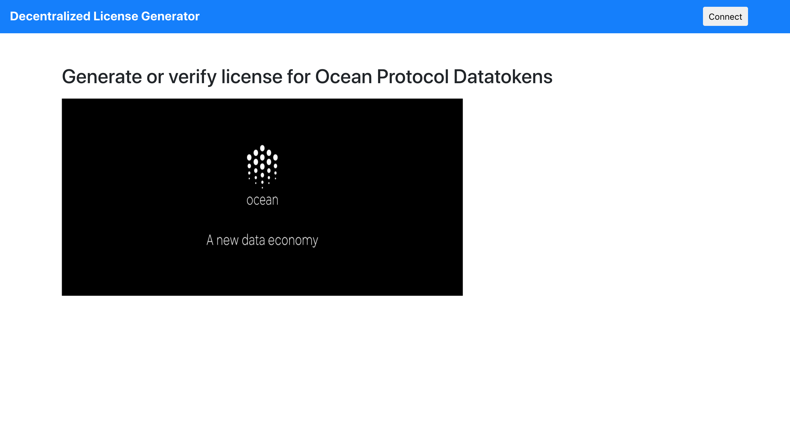
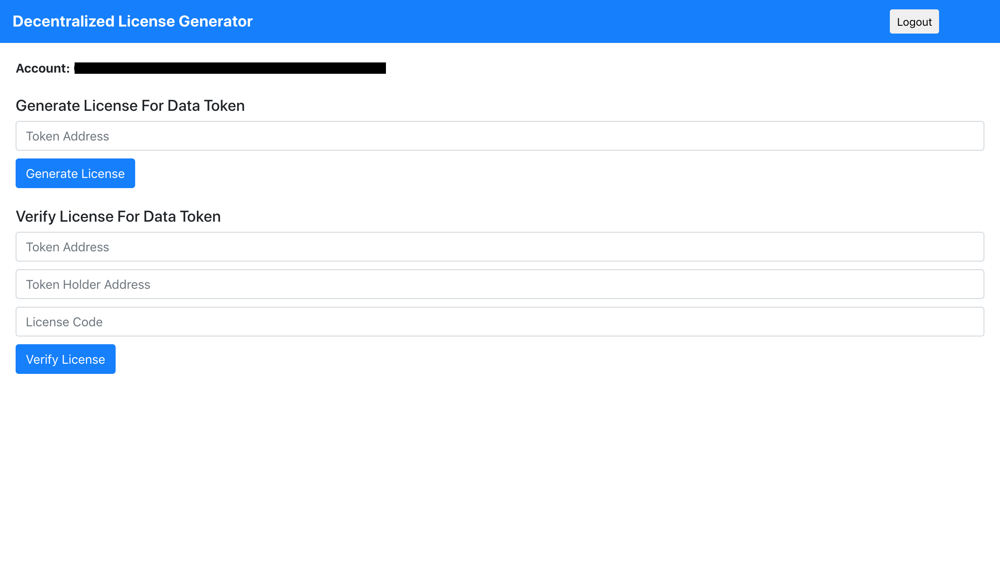
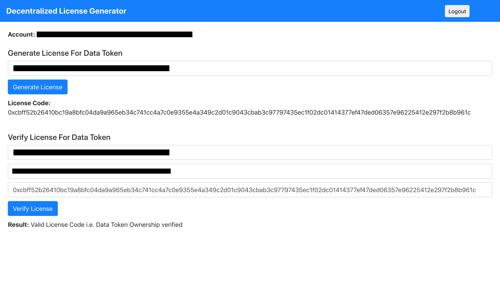

## Decentralized License Generator
Generate or verify license for Ocean Protocol Datatokens

### App Link
Decentralized License Generator (Rinkeby Network) - https://decentralized-license-generator.netlify.app/

### Screenshots







### Getting Started

1) Clone the repo

   ```
   git clone https://github.com/viraja1/decentralized_license_generator.git 
   ```

2) Change Directory

   ```
   cd decentralized_license_generator
   ```
   
3) Install packages

   ```
   npm install
   ```
   
4) Start the app   

   ```
   npm start 
   ```
   
5) Test the app

   http://localhost:3000/ 
